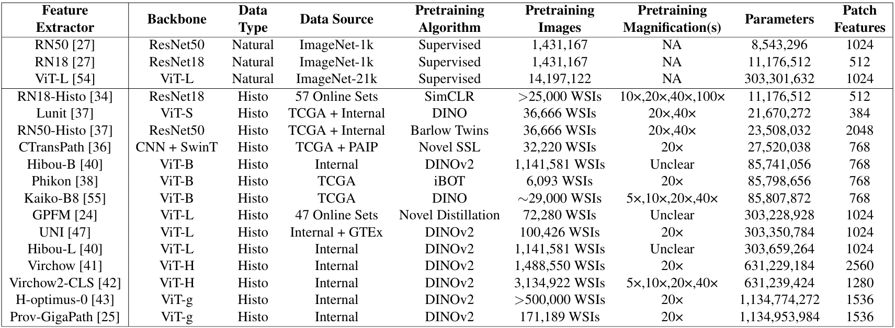

# A Comprehensive Evaluation of Histopathology Foundation Models for Ovarian Cancer Subtype Classification


## [Journal Paper](https://doi.org/10.1038/s41698-025-00799-8) | [Preprint](https://arxiv.org/abs/2405.09990)


Ovarian cancer histological subtype classification using ([ABMIL](https://proceedings.mlr.press/v80/ilse18a.html?ref=https://githubhelp.com)) with 17 feature extraction models (three ImageNet-pretrained models, fourteen histopathology foundation models):



## Code Examples
The following code includes examples from each stage of pre-processing, hyperparameter tuning, and model validation.  

<details>
<summary>
Tissue segmentation and tissue patch extraction 
</summary>
1024x1024 pixel patches at 40x native magnification for internal data and 512x512 at 20x native magnification for external data, so that after downsampling to apparent 10x magnification, patches will be 256x256. 

``` shell
## Internal data with CLAM default segmentation paramters 
python create_patches_fp.py --source "/mnt/data/Katie_WSI/edrive" --save_dir "/mnt/results/patches/ovarian_leeds_mag40x_patch1024_DGX_fp" --patch_size 1024 --step_size 1024 --seg --patch --stitch
## Internal data with Otsu thresholding segmentation and manually adjusted parameters
python create_patches_fp.py --source "/mnt/data/Katie_WSI/edrive" --save_dir "/mnt/results/patches/ovarian_leeds_mag40x_patch1024_DGX_fp_otsu" --patch_size 1024 --step_size 1024 --seg --patch --stitch --max_holes 100 --closing 20 --use_otsu --sthresh 0 --max_holes 20 --mthresh 15	
## External data with CLAM default segmentation parameters
python create_patches_fp.py --source "/mnt/data/transcanadian_WSI" --save_dir "/mnt/results/patches/transcanadian_mag20x_patch512_DGX_fp" --patch_size 512 --step_size 512 --seg --patch --stitch
## External data with Otsu thresholding segmentation and manually adjusted parameters
python create_patches_fp.py --source "/mnt/data/transcanadian_WSI" --save_dir "/mnt/results/patches/transcanadian_mag20x_patch512_DGX_fp_otsu" --patch_size 512 --step_size 512 --seg --patch --stitch --max_holes 100 --closing 20 --use_otsu --sthresh 0 --max_holes 20 --mthresh 15	
``` 
</details>


<details>
<summary>
Patch feature extraction 
</summary>
Feature extraction using 256x256 pixel patches at 10x apparent magnification, with various preprocessing and pretraining techniques, and model archiectures. Code here is for internal data, with the only notable difference in external data being a custom_downsample of 2 rather than 4 given the native 20x magnification rather than the internal 40x. All feature extraction models are ImageNet-pretrained unless explicitly listed as "histo-pretrained".

``` shell
## Baseline ResNet50
python extract_features_fp.py --hardware DGX --custom_downsample 4 --model_type 'resnet50' --data_h5_dir "/mnt/results/patches/ovarian_leeds_mag40x_patch1024_DGX_fp" --data_slide_dir "/mnt/data/Katie_WSI/edrive" --csv_path "dataset_csv/set_edrivepatches_ESGO_train_staging.csv" --feat_dir "/mnt/results/features/ovarian_leeds_resnet50_10x_features_DGX" --batch_size 32 --slide_ext .svs
## Baseline ResNet50 with Otsu thresholding in patch extraction
python extract_features_fp.py --hardware DGX --custom_downsample 4 --model_type 'resnet50' --data_h5_dir "/mnt/results/patches/ovarian_leeds_mag40x_patch1024_DGX_fp_otsu" --data_slide_dir "/mnt/data/Katie_WSI/edrive" --csv_path "dataset_csv/set_edrivepatches.csv" --feat_dir "/mnt/results/features/ovarian_leeds_resnet50_10x_features_DGX_otsu" --batch_size 32 --slide_ext .svs 
## Reinhard normalised ResNet50
python extract_features_fp.py --hardware DGX --custom_downsample 4 --model_type 'resnet50' --data_h5_dir "/mnt/results/patches/ovarian_leeds_mag40x_patch1024_DGX_fp" --data_slide_dir "/mnt/data/Katie_WSI/edrive" --csv_path "dataset_csv/set_edrivepatches.csv" --feat_dir "/mnt/results/features/ovarian_leeds_resnet50_10x_features_DGX_reinhard" --batch_size 32 --slide_ext .svs --use_transforms reinhard
## Macenko normalised ResNet50
python extract_features_fp.py --hardware DGX --custom_downsample 4 --model_type 'resnet50' --data_h5_dir "/mnt/results/patches/ovarian_leeds_mag40x_patch1024_DGX_fp" --data_slide_dir "/mnt/data/Katie_WSI/edrive" --csv_path "dataset_csv/set_edrivepatches.csv" --feat_dir "/mnt/results/features/ovarian_leeds_resnet50_10x_features_DGX_macenko" --batch_size 32 --slide_ext .svs --use_transforms macenko
## Macenko normalised ResNet50 with Otsu thresholding
python extract_features_fp.py --hardware DGX --custom_downsample 4 --model_type 'resnet50' --data_h5_dir "/mnt/results/patches/ovarian_leeds_mag40x_patch1024_DGX_fp_otsu" --data_slide_dir "/mnt/data/Katie_WSI/edrive" --csv_path "dataset_csv/set_edrivepatches.csv" --feat_dir "/mnt/results/features/ovarian_leeds_resnet50_10x_features_DGX_otsu_macenko" --batch_size 32 --slide_ext .svs --use_transforms macenko
## Colour augmented ResNet50 (Repeated 20 times)
python extract_features_fp.py --hardware DGX --custom_downsample 4 --model_type 'resnet50' --data_h5_dir "/mnt/results/patches/ovarian_leeds_mag40x_patch1024_DGX_fp" --data_slide_dir "/mnt/data/Katie_WSI/edrive" --csv_path "dataset_csv/set_edrivepatches.csv" --feat_dir "/mnt/results/features/ovarian_leeds_resnet50_10x_features_DGX_colourjitternorm_1" --batch_size 32 --slide_ext .svs --use_transforms colourjitternorm
## Baseline ResNet18
python extract_features_fp.py --hardware DGX --custom_downsample 4 --model_type 'resnet18' --data_h5_dir "/mnt/results/patches/ovarian_leeds_mag40x_patch1024_DGX_fp" --data_slide_dir "/mnt/data/Katie_WSI/edrive" --csv_path "dataset_csv/StagingAndIDSTrain_edrive.csv" --feat_dir "/mnt/results/features/ovarian_leeds_resnet18_10x_features_DGX" --batch_size 32 --slide_ext .svs
## Histo-pretrained ResNet18
python extract_features_fp.py --hardware DGX --custom_downsample 4 --model_type 'resnet18' --pretraining_dataset Histo --data_h5_dir "/mnt/results/patches/ovarian_leeds_mag40x_patch1024_DGX_fp" --data_slide_dir "/mnt/data/Katie_WSI/edrive" --csv_path "dataset_csv/StagingAndIDSTrain_edrive.csv" --feat_dir "/mnt/results/features/ovarian_leeds_resnet18_10x_features_DGX_histotrained_fixed224" --batch_size 32 --slide_ext .svs --use_transforms histo_resnet18_224
## ViT-L Baseline
python extract_features_fp.py --hardware DGX --custom_downsample 4 --model_type 'vit_l' --use_transforms uni_default --data_h5_dir "/mnt/results/patches/ovarian_leeds_mag40x_patch1024_DGX_fp" --data_slide_dir "/mnt/data/Katie_WSI/edrive" --csv_path "dataset_csv/StagingAndIDSTrain_edrive.csv" --feat_dir "/mnt/results/features/ovarian_leeds_vitl_10x_features_DGX" --batch_size 32 --slide_ext .svs
## Histo-pretrained ViT-L (UNI)
python extract_features_fp.py --hardware DGX --custom_downsample 4 --model_type 'uni' --use_transforms uni_default --data_h5_dir "/mnt/results/patches/ovarian_leeds_mag40x_patch1024_DGX_fp" --data_slide_dir "/mnt/data/Katie_WSI/edrive" --csv_path "dataset_csv/StagingAndIDSTrain_edrive.csv" --feat_dir "/mnt/results/features/ovarian_leeds_uni_10x_features_DGX" --batch_size 32 --slide_ext .svs
``` 
</details>

<details>
<summary>
Hyperparameter Tuning
</summary>
Hyperparameter configurations can be found in the folder "tuning_configs". Separate main.py calls were used for each cross-validation fold to allow for parallelisation.

``` shell
## ResNet50 Baseline Tuning Iteration 1, Fold 0
python main.py --tuning --hardware DGX --tuning_output_file /mnt/results/tuning_results/staging_only_resnet50_20x_tuning1_bce_fold0.csv --min_epochs 0 --max_epochs 100 --early_stopping --num_tuning_experiments 1 --split_dir "staging_and_ids_100" --k_start 0 --k_end 1 --results_dir /mnt/results --exp_code stagingandids_resnet50_20x_tuning1_100epochs_bce_NORMAL_fold0 --subtyping --weighted_sample --bag_loss balanced_ce --no_inst_cluster --task ovarian_5class  --model_type clam_sb --subtyping --csv_path 'dataset_csv/ESGO_train_all.csv' --data_root_dir "/mnt/results/features" --features_folder "ovarian_leeds_resnet50_20x_features_DGX" --tuning_config_file tuning_configs/esgo_stagingandids_resnet50_20x_NORMAL_config1.txt
## Combining results across five cross-validation folds
python combine_results.py --file_base_name "/mnt/results/tuning_results/staging_only_resnet50_20x_tuning1_bce"

## ResNet50 Baseline Tuning Iteration 19 (final iteration), Fold 4
python main.py --tuning --hardware DGX --tuning_output_file /mnt/results/tuning_results/stagingandids_resnet50_10x_tuning19_300epochs_30patience_bce_fold4.csv --min_epochs 0 --max_epochs 300 --early_stopping --num_tuning_experiments 1 --tuning_patience 30 --split_dir "staging_and_ids_100" --k_start 4 --k_end 5 --results_dir /mnt/results --exp_code stagingandids_resnet50_10x_tuning19_300epochs_30patience_bce_NORMAL_fold4 --subtyping --weighted_sample --bag_loss balanced_ce --no_inst_cluster --task ovarian_5class  --model_type clam_sb --subtyping --csv_path 'dataset_csv/ESGO_train_all.csv' --data_root_dir "/mnt/results/features" --features_folder "ovarian_leeds_resnet50_10x_features_DGX" --tuning_config_file tuning_configs/esgo_stagingandids_resnet50_10x_normal_config19.txt
## Combining results across five cross-validation folds
python combine_results.py --file_base_name "/mnt/results/tuning_results/stagingandids_resnet50_10x_tuning19_300epochs_30patience_bce"

``` 
</details>


<details>
<summary>
Model Training
</summary>
Training each model with the best hyperparameters from tuning.

``` shell
## Baseline ResNet50
python main.py --hardware DGX --min_epochs 0 --max_epochs 300 --early_stopping --split_dir "staging_and_ids_100" --k 5 --results_dir /mnt/results --exp_code stagingandids_resnet50_10x_bestfrom19tuning_bce_normal --subtyping --weighted_sample --bag_loss balanced_ce --no_inst_cluster --task ovarian_5class  --model_type clam_sb --subtyping --csv_path 'dataset_csv/ESGO_train_all.csv' --data_root_dir "/mnt/results/features" --features_folder "ovarian_leeds_resnet50_10x_features_DGX" --reg 1e-3 --drop_out 0.4 --lr 2e-3 --max_patches_per_slide 800 --model_size smaller --beta1 0.75 --beta2 0.95 --eps 1e-2 --lr_factor 0.75 --lr_patience 20
``` 
</details>

<details>
<summary>
Model Evaluation
</summary>
Classifying each slide, then generating the final results using the mean and 95% CI from 10,000 iterations of bootstrapping.

``` shell
## Five-fold cross-validation (baseline ResNet50)
python eval.py --drop_out 0.4 --model_size smaller --models_exp_code stagingandids_resnet50_10x_bestfrom19tuning_bce_normal_s1 --save_exp_code stagingandids_resnet50_10x_bestfrom19tuning_bce_normal_bootstrapping --task ovarian_5class --model_type clam_sb --results_dir /mnt/results --data_root_dir "/mnt/results/features" --k 5 --features_folder "ovarian_leeds_resnet50_10x_features_DGX" --csv_path 'dataset_csv/ESGO_train_all.csv' 
python bootstrapping.py --num_classes 5 --model_names stagingandids_resnet50_10x_bestfrom19tuning_bce_normal_bootstrapping --bootstraps 10000 --run_repeats 1 --folds 5

## Ensembled hold-out test set (baseline ResNet50)
python eval.py --split_dir splits/esgo_test_splits --drop_out 0.4 --model_size smaller --models_exp_code stagingandids_resnet50_10x_bestfrom19tuning_bce_normal_s1 --save_exp_code stagingandids_resnet50_10x_bestfrom19tuning_bce_normal_holdouttest_s1 --task ovarian_5class --model_type clam_sb --results_dir /mnt/results --data_root_dir "/mnt/results/features" --k 5 --features_folder "ovarian_leeds_resnet50_10x_features_DGX" --csv_path 'dataset_csv/ESGO_test_set.csv'
python bootstrapping.py --ensemble --num_classes 5 --model_names stagingandids_resnet50_10x_bestfrom19tuning_bce_normal_holdouttest_s1 --bootstraps 10000 --run_repeats 1 --folds 5

## Ensembled external validation set (baseline ResNet50)
python eval.py --split_dir splits/external_splits --drop_out 0.4 --model_size smaller --models_exp_code stagingandids_resnet50_10x_bestfrom19tuning_bce_normal_s1 --save_exp_code stagingandids_resnet50_10x_bestfrom19tuning_bce_normal_externaltest_s1 --task ovarian_5class --model_type clam_sb --results_dir /mnt/results --data_root_dir "/mnt/results/features" --k 5 --features_folder "transcanadian_resnet50_10x_features_DGX" --csv_path 'dataset_csv/ExternalData.csv'
python bootstrapping.py --ensemble --num_classes 5 --model_names stagingandids_resnet50_10x_bestfrom19tuning_bce_normal_externaltest_s1 --bootstraps 10000 --run_repeats 1 --folds 5
```
</details>


## Reference
This code is an extension of our [previous repository](https://github.com/scjjb/DRAS-MIL), which was originally based on the [CLAM repository](https://github.com/mahmoodlab/CLAM) with corresponding [paper](https://www.nature.com/articles/s41551-020-00682-w). This repository and the original CLAM repository are both available for non-commercial academic purposes under the GPLv3 License.
